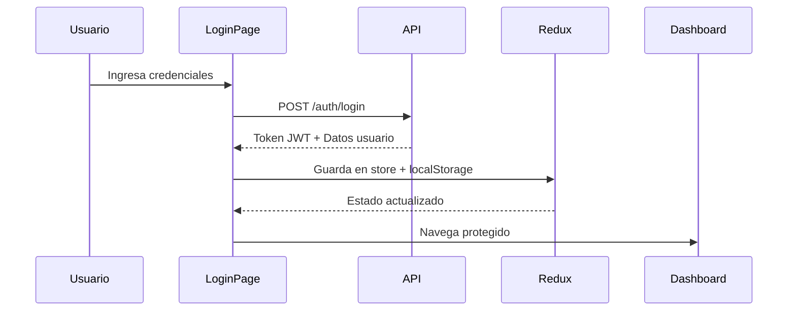

# 🏛️ DICRI Indicios - Frontend

Sistema web del **Ministerio Público de Guatemala** para la gestión integral de indicios forenses y expedientes criminales del Departamento de Investigaciones Criminalísticas (DICRI).

[](https://react.dev)
[](https://www.typescriptlang.org/)
[](https://vitejs.dev)
[](https://mui.com)
[](https://www.docker.com/)

---

## 📑 Tabla de Contenidos

- [Características Principales](#-características-principales)
- [Tecnologías](#-tecnologías)
- [Arquitectura](#-arquitectura-del-proyecto)
- [Instalación Rápida](#-instalación-rápida)
- [Configuración](#-configuración)
- [Scripts Disponibles](#-scripts-disponibles)
- [Docker](#-docker)
- [API Endpoints](#-api-endpoints)
- [Autenticación](#-autenticación)
- [Módulos del Sistema](#-módulos-del-sistema)
- [Optimizaciones de Performance](#-optimizaciones-de-performance)
- [Testing](#-testing)
- [Deployment](#-deployment)
- [Troubleshooting](#-troubleshooting)
- [Contribución](#-contribución)
- [Licencia](#-licencia)

---

## ✨ Características Principales

### 🔐 Gestión de Autenticación
- Login con JWT tokens
- Persistencia de sesión con Redux Persist
- Auto-logout por token expirado
- Cambio de contraseña obligatorio
- Verificación de roles y permisos
- Gestión de perfiles de usuario

### 📁 Gestión de Expedientes (DICRI)
- **Estados**: `EN_REGISTRO` → `PENDIENTE_REVISION` → `APROBADO/RECHAZADO`
- CRUD completo de expedientes
- Filtros avanzados (estado, fiscalía, usuario, activo)
- Flujo de revisión y aprobación
- Trazabilidad de cambios
- Justificación de rechazos

### 🔍 Gestión de Escenas del Crimen
- Registro de múltiples escenas por expediente
- Geolocalización y dirección
- Fecha y hora de inicio/fin de procesamiento
- Estado activo/inactivo
- Relación 1:N con expedientes

### 🧪 Gestión de Indicios
- CRUD completo de indicios
- Clasificación por tipo (arma, huella, documento, etc.)
- Estados: `RECOLECTADO` → `EN_CUSTODIA` → `EN_ANALISIS` → `ANALIZADO` → `DEVUELTO`
- Cadena de custodia
- Ubicación específica y coordenadas
- Fotos y evidencias (próximamente)
- Relación con escenas y expedientes

### 📊 Reportes y Estadísticas
- Dashboard con indicadores clave
- Distribución por fiscalía
- Estados de expedientes en tiempo real
- Total de indicios recolectados
- Gráficas y visualizaciones

### 🗂️ Catálogos Administrativos
- Fiscalías
- Tipos de Indicio
- Roles y Permisos
- Perfiles de Usuario
- Usuarios del sistema

### 🎨 UI/UX Moderna
- Diseño responsive (móvil, tablet, desktop)
- Material Design (MUI)
- Dark/Light mode (próximamente)
- Lazy loading de componentes
- Hot reload en desarrollo
- Optimización de performance

---

## 🚀 Tecnologías

### Frontend Core
- **React 18.3** - Biblioteca UI con Concurrent Features
- **TypeScript 5.9** - Tipado estático y type safety
- **Vite 7.2** - Build tool ultrarrápido con HMR
- **React Router 7.9** - Routing con Suspense y lazy loading

### Estado y Datos
- **Redux Toolkit 2.2** - Gestión de estado global
- **React Redux 9.1** - Bindings para React
- **Redux Persist 6.0** - Persistencia de estado en localStorage
- **Axios 1.13** - Cliente HTTP con interceptors

### UI y Estilos
- **Material-UI 5.15** - Sistema de diseño y componentes
- **@mui/icons-material** - Iconografía completa
- **@emotion/react & styled** - CSS-in-JS
- **Custom CSS** - Estilos específicos

### Seguridad
- **JWT Decode 4.0** - Decodificación de tokens JWT
- **HTTP Interceptors** - Manejo automático de auth
- **Protected Routes** - Rutas con guards de autenticación

### DevOps y Build
- **Docker & Docker Compose** - Contenerización
- **Nginx Alpine** - Servidor web de producción
- **ESLint 9.39** - Linting y code quality
- **TypeScript ESLint** - Reglas específicas para TS

---

## 🏗️ Arquitectura del Proyecto

El proyecto sigue **Clean Architecture** con separación de capas:

```
src/
├── domain/                      # 🎯 Capa de Dominio
│   ├── entities/               # Modelos de negocio
│   │   ├── Auth.ts            # Usuario, Login, JWT
│   │   ├── User.ts            # Usuario, Perfil, Role
│   │   ├── Module.ts          # Módulos del sistema
│   │   ├── Expediente.ts      # Investigación DICRI
│   │   ├── Escena.ts          # Escena del crimen
│   │   ├── Indicio.ts         # Indicio/Evidencia
│   │   ├── Fiscalia.ts        # Fiscalía
│   │   ├── TipoIndicio.ts     # Catálogo tipos
│   │   ├── Reportes.ts        # Estadísticas
│   │   └── ApiResponse.ts     # Respuestas API
│   └── repositories/           # Interfaces de repositorios
│       ├── IAuthRepository.ts
│       ├── IUserRepository.ts
│       ├── IExpedienteRepository.ts
│       ├── IEscenaRepository.ts
│       └── IIndicioRepository.ts
│
├── infrastructure/              # ⚙️ Capa de Infraestructura
│   ├── config/                 # Configuración
│   │   └── config.ts          # Variables de entorno
│   ├── http/                   # Cliente HTTP
│   │   └── HttpClient.ts      # Axios + Interceptors
│   └── repositories/           # Implementaciones
│       ├── AuthRepository.ts
│       ├── UserRepository.ts
│       ├── ExpedienteRepository.ts
│       ├── EscenaRepository.ts
│       ├── IndicioRepository.ts
│       ├── FiscaliaRepository.ts
│       ├── TipoIndicioRepository.ts
│       └── ReportesRepository.ts
│
├── presentation/                # 🎨 Capa de Presentación
│   ├── components/             # Componentes reutilizables
│   │   └── PasswordField.tsx
│   ├── pages/                  # Páginas principales
│   │   ├── LoginPage.tsx
│   │   ├── DashboardHome.tsx
│   │   ├── ExpedientesListPage.tsx
│   │   ├── ExpedienteDetailPage.tsx
│   │   ├── ExpedienteEditPage.tsx
│   │   ├── ExpedienteCreatePage.tsx
│   │   ├── ScenesExpedientePage.tsx
│   │   ├── SceneCreatePage.tsx
│   │   ├── SceneEditPage.tsx
│   │   ├── SceneIndiciosPage.tsx
│   │   ├── IndiciosExpedientePage.tsx
│   │   ├── IndicioCreatePage.tsx
│   │   ├── IndicioEditPage.tsx
│   │   ├── RevisionExpedientesPage.tsx
│   │   ├── RevisionExpedienteDetailPage.tsx
│   │   ├── FiscaliasListPage.tsx
│   │   ├── FiscaliaDetailPage.tsx
│   │   ├── FiscaliaCreatePage.tsx
│   │   ├── TiposIndicioListPage.tsx
│   │   ├── TipoIndicioDetailPage.tsx
│   │   ├── TipoIndicioCreatePage.tsx
│   │   ├── ReportesPage.tsx
│   │   ├── AdminHomePage.tsx
│   │   ├── RolesListPage.tsx
│   │   ├── PerfilesListPage.tsx
│   │   ├── UsersPage.tsx
│   │   ├── UserDetailPage.tsx
│   │   └── ChangePasswordPage.tsx
│   ├── layouts/                # Plantillas
│   │   └── DashboardLayout.tsx
│   ├── routes/                 # Rutas protegidas
│   │   ├── ProtectedRoute.tsx
│   │   └── AdminRoute.tsx
│   ├── context/                # React Context
│   │   └── AuthContext.tsx
│   ├── theme/                  # Material-UI Theme
│   │   └── theme.ts
│   ├── utils/                  # Utilidades
│   │   └── iconMapper.ts
│   └── store/                  # Redux (legacy, migrado)
│
├── store/                       # 🗄️ Redux Store (actual)
│   ├── store.ts                # Configuración del store
│   └── authSlice.ts            # Slice de autenticación
│
├── App.tsx                      # 🎯 App principal con rutas
├── main.tsx                     # 🚀 Entry point
└── vite-env.d.ts               # Types de Vite
```

---

## ⚡ Instalación Rápida

### Requisitos Previos
- **Node.js** v20 o superior
- **npm** v10 o superior
- **Docker** (opcional, para contenedores)

```bash
# Verificar versiones
node --version  # v20+
npm --version   # v10+
```

### Instalación

```bash
# 1. Clonar el repositorio
git clone <repository-url>
cd Dicri-indicios

# 2. Instalar dependencias
npm install

# 3. Configurar variables de entorno
cp .env.example .env.development

# 4. Iniciar servidor de desarrollo
npm run dev
```

✅ **Aplicación disponible en:** `http://localhost:5173`

---

## 🔧 Configuración

### Variables de Entorno

#### `.env.development` (Desarrollo)
```env
VITE_API_BASE_URL=http://localhost:3030/api
VITE_APP_NAME=DICRI Indicios
VITE_APP_ENV=development
```

#### `.env` (Producción)
```env
VITE_API_BASE_URL=https://api.mp.gob.gt/api
VITE_APP_NAME=DICRI Indicios
VITE_APP_ENV=production
```

#### `.env.example` (Template)
```env
VITE_API_BASE_URL=http://localhost:3030/api
VITE_APP_NAME=DICRI Indicios
VITE_APP_ENV=development
```

> **Seguridad**: Los archivos `.env*` están en `.gitignore` y no se suben al repositorio.

---

## 📦 Scripts Disponibles

### Desarrollo
```bash
npm run dev          # Servidor de desarrollo (puerto 5173)
npm run preview      # Preview del build de producción
```

### Build
```bash
npm run build        # Build optimizado de producción
npm run build:dev    # Build con config de desarrollo
npm run build:prod   # Build con config de producción
```

### Linting
```bash
npm run lint         # Ejecuta ESLint en todo el proyecto
```

### Docker
```bash
npm run docker:build:dev   # Build imagen Docker desarrollo
npm run docker:build:prod  # Build imagen Docker producción
npm run docker:up          # Levanta contenedores
npm run docker:down        # Detiene y limpia contenedores
```

---

## 🐳 Docker

### Docker Compose (Recomendado)

#### Desarrollo con Hot Reload (Puerto 8080)
```bash
# Levantar contenedor de desarrollo
docker-compose up -d frontend-dev

# Ver logs en tiempo real
docker-compose logs -f frontend-dev

# Detener contenedor
docker-compose down frontend-dev
```

**Características del modo desarrollo:**
- ✅ Hot Module Replacement (HMR)
- ✅ File watching con polling (Windows compatible)
- ✅ Volúmenes sincronizados
- ✅ Recarga automática de cambios

**Acceso:** `http://localhost:8080`

#### Producción con Nginx (Puerto 8081)
```bash
# Levantar contenedor de producción
docker-compose up -d frontend-prod

# Ver logs
docker-compose logs -f frontend-prod

# Detener contenedor
docker-compose down frontend-prod
```

**Características del modo producción:**
- ✅ Build optimizado con code splitting
- ✅ Nginx Alpine (imagen ligera)
- ✅ Compresión gzip habilitada
- ✅ Cache de assets

**Acceso:** `http://localhost:8081`

### Docker Manual

#### Build de Imagen
```bash
docker build -t dicri-frontend:latest \
  --build-arg VITE_API_BASE_URL=http://localhost:3030/api \
  .
```

#### Ejecutar Contenedor
```bash
docker run -d \
  -p 8080:80 \
  --name dicri-frontend \
  --network dicri-network \
  dicri-frontend:latest
```

#### Detener y Limpiar
```bash
docker stop dicri-frontend
docker rm dicri-frontend
docker rmi dicri-frontend:latest
```

### Crear Red de Docker (Primera vez)
```bash
docker network create dicri-network
```

---

## 🔌 API Endpoints

### Base URL
- **Desarrollo**: `http://localhost:3030/api`
- **Producción**: `https://api.mp.gob.gt/api`

### 🔐 Autenticación

#### Login
```http
POST /auth/login
Content-Type: application/json

{
  "nombre_usuario": "admin",
  "clave": "admin123"
}
```

**Respuesta (200):**
```json
{
  "success": true,
  "message": "✨ Login exitoso ✨",
  "data": {
    "token": "eyJhbGciOiJIUzI1NiIsInR5cCI6IkpXVCJ9...",
    "usuario": {
      "id_usuario": 1,
      "nombre_usuario": "admin",
      "nombre": "Administrador",
      "apellido": "Sistema",
      "email": "admin@dicri.com",
      "cambiar_clave": true
    },
    "perfiles": [...],
    "roles": [...],
    "modulos": [...]
  }
}
```

#### Verificar Token
```http
GET /auth/verify
Authorization: Bearer {token}
```

#### Cambiar Contraseña
```http
POST /auth/change-password
Authorization: Bearer {token}
Content-Type: application/json

{
  "clave_actual": "admin123",
  "clave_nueva": "NuevaC0ntr@señ@"
}
```

#### Obtener Usuario Actual
```http
GET /auth/me
Authorization: Bearer {token}
```

---

### 📁 Expedientes (Investigaciones DICRI)

#### Listar Expedientes
```http
GET /expedientes?estado_revision_dicri=EN_REGISTRO&id_fiscalia=1&activo=true
```

**Query Params:**
- `estado_revision_dicri`: `EN_REGISTRO`, `PENDIENTE_REVISION`, `APROBADO`, `RECHAZADO`
- `id_fiscalia`: ID de fiscalía
- `id_usuario_registro`: ID del usuario registrador
- `activo`: `true` o `false`

#### Obtener Expediente por ID
```http
GET /expedientes/:id
```

#### Crear Expediente
```http
POST /expedientes
Content-Type: application/json

{
  "codigo_caso": "MP001-2025-1005",
  "nombre_caso": "Homicidio en Zona 11",
  "fecha_inicio": "2025-11-20",
  "id_fiscalia": 1,
  "descripcion_hechos": "Investigación sobre hallazgo de cuerpo con herida de bala"
}
```

**Respuesta (201):**
```json
{
  "success": true,
  "message": "Expediente creado exitosamente",
  "data": {
    "id_investigacion": 9,
    "codigo_caso": "MP001-2025-1005",
    "estado_revision_dicri": "EN_REGISTRO",
    "usuario_creacion": "admin",
    "fecha_creacion": "2025-11-22T21:38:19.943Z"
  }
}
```

#### Actualizar Expediente
```http
PUT /expedientes/:id
Content-Type: application/json

{
  "nombre_caso": "Homicidio en Zona 11 - Actualizado",
  "descripcion_hechos": "Descripción ajustada",
  "estado_revision_dicri": "PENDIENTE_REVISION",
  "activo": true
}
```

#### Eliminar Expediente
```http
DELETE /expedientes/:id
```

#### Aprobar Expediente (COORDINADOR_DICRI)
```http
POST /expedientes/:id/aprobar
Authorization: Bearer {token}
```

#### Rechazar Expediente (COORDINADOR_DICRI)
```http
POST /expedientes/:id/rechazar
Content-Type: application/json

{
  "justificacion": "Información incompleta en la descripción de hechos"
}
```

---

### 🏛️ Escenas del Crimen

#### Listar Escenas por Expediente
```http
GET /escenas?id_expediente=:id_investigacion
```

#### Obtener Escena por ID
```http
GET /escenas/:id
```

#### Crear Escena
```http
POST /escenas
Content-Type: application/json

{
  "id_investigacion": 1,
  "nombre_escena": "Lugar del Crimen",
  "direccion_escena": "Avenida Reforma, Edificio X, Zona 10",
  "fecha_hora_inicio": "2025-11-20T08:00:00Z",
  "fecha_hora_fin": null,
  "latitud": 14.5995,
  "longitud": -90.5087,
  "activo": true
}
```

#### Actualizar Escena
```http
PUT /escenas/:id
Content-Type: application/json

{
  "fecha_hora_fin": "2025-11-20T14:00:00Z",
  "activo": true
}
```

#### Eliminar Escena
```http
DELETE /escenas/:id
```

---

### 🧪 Indicios

#### Listar Indicios por Expediente
```http
GET /expedientes/:id_investigacion/indicios
```

#### Listar Indicios por Escena
```http
GET /indicios?id_escena=:id_escena
```

#### Crear Indicio en Expediente
```http
POST /expedientes/:id_investigacion/indicios
Content-Type: application/json

{
  "codigo_indicio": "IND-001-2025",
  "id_escena": 1,
  "id_tipo_indicio": 1,
  "descripcion_corta": "Arma de fuego calibre 9mm",
  "ubicacion_especifica": "Sala principal, junto a la ventana",
  "fecha_hora_recoleccion": "2025-11-20T14:30:00Z"
}
```

**Respuesta (201):**
```json
{
  "success": true,
  "message": "Indicio creado exitosamente",
  "data": {
    "id_indicio": 3,
    "codigo_indicio": "IND-001-2025",
    "estado_actual": "RECOLECTADO",
    "tipo_indicio": "Arma de Fuego",
    "nombre_escena": "Lugar del Crimen"
  }
}
```

#### Actualizar Indicio
```http
PUT /indicios/:id
Content-Type: application/json

{
  "estado_actual": "EN_CUSTODIA",
  "ubicacion_especifica": "Bodega de evidencias - Estante A3"
}
```

**Estados válidos:**
- `RECOLECTADO` → `EN_CUSTODIA` → `EN_ANALISIS` → `ANALIZADO` → `DEVUELTO`

#### Eliminar Indicio
```http
DELETE /indicios/:id
```

---

### 🗂️ Catálogos

#### Fiscalías
```http
GET    /fiscalias
GET    /fiscalias/:id
POST   /fiscalias
PUT    /fiscalias/:id
DELETE /fiscalias/:id
```

#### Tipos de Indicio
```http
GET    /tipos-indicio
GET    /tipos-indicio/:id
POST   /tipos-indicio
PUT    /tipos-indicio/:id
DELETE /tipos-indicio/:id
```

#### Roles
```http
GET    /roles
GET    /roles/:id
POST   /roles
PUT    /roles/:id
DELETE /roles/:id
```

#### Perfiles
```http
GET    /perfiles
GET    /perfiles/:id
POST   /perfiles
PUT    /perfiles/:id
DELETE /perfiles/:id
```

---

### 📊 Reportes y Estadísticas

#### Estadísticas Generales
```http
GET /reportes/estadisticas-generales
```

**Respuesta:**
```json
{
  "success": true,
  "data": {
    "total_expedientes": 120,
    "en_registro": 45,
    "pendiente_revision": 30,
    "aprobados": 40,
    "rechazados": 5,
    "total_indicios": 450,
    "expedientes_por_fiscalia": [
      { "nombre_fiscalia": "Fiscalía Contra la Vida", "total": 35 },
      { "nombre_fiscalia": "Fiscalía de Delitos Sexuales", "total": 28 }
    ]
  }
}
```

---

## 🔐 Autenticación

### Flujo de Autenticación



### Persistencia de Sesión

- **Redux Persist**: Estado guardado en `localStorage`
- **Token JWT**: Almacenado con key `dicri_auth_token`
- **Datos de usuario**: `dicri_auth_user`
- **Módulos**: `dicri_auth_modulos`
- **Perfiles y Roles**: `dicri_auth_perfiles`, `dicri_auth_roles`

### Auto-Logout

El sistema cierra sesión automáticamente si:
- ❌ Token expirado (verificado en cada request)
- ❌ Token inválido o corrupto
- ❌ Respuesta 401 del backend
- ❌ Usuario elimina manualmente el token

### Roles y Permisos

- **ADMIN**: Acceso total al sistema
- **COORDINADOR_DICRI**: Revisión y aprobación de expedientes
- **FISCAL**: Ver expedientes asignados
- **INVESTIGADOR**: Crear y editar expedientes
- **RECOLECTOR**: Registrar indicios

---

## 🎯 Módulos del Sistema

### 1. Dashboard Principal
- Estadísticas generales
- Indicadores visuales
- Distribución por fiscalía
- Acceso rápido a módulos

### 2. Gestión de Expedientes
- Lista con filtros avanzados
- Creación de nuevos expedientes
- Edición (solo en `EN_REGISTRO`)
- Vista de detalle completa
- Gestión de escenas asociadas
- Gestión de indicios asociados

### 3. Gestión de Escenas
- Lista de escenas por expediente
- Registro de nueva escena
- Edición de escena existente
- Geolocalización
- Indicios por escena

### 4. Gestión de Indicios
- Lista de indicios por expediente/escena
- Registro de nuevo indicio
- Edición de indicio
- Cambio de estado
- Cadena de custodia

### 5. Revisión de Expedientes (COORDINADOR)
- Lista de pendientes de revisión
- Aprobar expediente
- Rechazar con justificación
- Historial de revisiones

### 6. Reportes y Estadísticas
- Dashboard con métricas
- Gráficas interactivas
- Exportación de datos (próximamente)

### 7. Administración
- Gestión de usuarios
- Roles y permisos
- Perfiles de usuario
- Catálogos (Fiscalías, Tipos de Indicio)

### 8. Cambiar Contraseña
- Validación de contraseña actual
- Requisitos de complejidad
- Indicador de fortaleza
- Confirmación visual

---

## ⚡ Optimizaciones de Performance

### Code Splitting
- **Lazy Loading** de componentes con `React.lazy()`
- **Suspense** para cargas asíncronas
- Chunks separados por vendors (React, MUI, Redux)

### Build Optimizations
```typescript
// vite.config.ts
build: {
  rollupOptions: {
    output: {
      manualChunks: {
        'react-vendor': ['react', 'react-dom', 'react-router-dom'],
        'mui-vendor': ['@mui/material', '@mui/icons-material'],
        'redux-vendor': ['@reduxjs/toolkit', 'react-redux', 'redux-persist'],
      },
    },
  },
  chunkSizeWarningLimit: 1000,
}
```

### Caching Strategy
- **Redux Persist**: Estado en localStorage
- **HTTP Caching**: Headers de Nginx
- **Service Worker**: (próximamente)

### Performance Metrics
- **Initial Load**: < 2s
- **DOMContentLoaded**: < 1s
- **Time to Interactive**: < 2.5s

---

## 🧪 Testing

### Configuración de Tests (Próximamente)

```bash
npm run test          # Ejecutar tests
npm run test:watch    # Watch mode
npm run test:coverage # Coverage report
```

### Stack de Testing Recomendado
- **Vitest** - Test runner
- **React Testing Library** - Component testing
- **MSW** - API mocking
- **Playwright** - E2E testing

---

## 🚀 Deployment

### Build de Producción

```bash
# Build optimizado
npm run build

# Preview del build
npm run preview
```

**Output:** Carpeta `dist/` con assets optimizados

### Deploy con Docker

```bash
# Build imagen de producción
docker build -t dicri-frontend:prod \
  --build-arg VITE_API_BASE_URL=https://api.mp.gob.gt/api \
  .

# Push a registry
docker tag dicri-frontend:prod registry.mp.gob.gt/dicri-frontend:latest
docker push registry.mp.gob.gt/dicri-frontend:latest

# Deploy en servidor
docker pull registry.mp.gob.gt/dicri-frontend:latest
docker run -d -p 80:80 --name dicri-frontend registry.mp.gob.gt/dicri-frontend:latest
```

### Nginx Configuration

```nginx
server {
  listen 80;
  server_name dicri.mp.gob.gt;
  
  root /usr/share/nginx/html;
  index index.html;
  
  # Gzip compression
  gzip on;
  gzip_types text/plain text/css application/json application/javascript;
  
  # SPA routing
  location / {
    try_files $uri $uri/ /index.html;
  }
  
  # Cache static assets
  location ~* \.(js|css|png|jpg|jpeg|gif|ico|svg)$ {
    expires 1y;
    add_header Cache-Control "public, immutable";
  }
}
```

### Variables de Entorno en Producción

```env
VITE_API_BASE_URL=https://api.mp.gob.gt/api
VITE_APP_NAME=DICRI Indicios
VITE_APP_ENV=production
```

---

## 🔧 Troubleshooting

### Error: "Cannot connect to API"
```bash
# 1. Verificar backend está corriendo
curl http://localhost:3030/api/health

# 2. Revisar variables de entorno
cat .env.development

# 3. Verificar CORS en backend
# Debe permitir origen: http://localhost:5173
```

### Error: "Token expired"
- El sistema cerrará sesión automáticamente
- Vuelve a hacer login con tus credenciales

### Error: "Port 5173 already in use"
```powershell
# Windows PowerShell
Get-Process -Id (Get-NetTCPConnection -LocalPort 5173).OwningProcess | Stop-Process -Force

# O cambiar puerto en vite.config.ts
server: { port: 5174 }
```

### Error: "Module not found"
```bash
# Limpiar cache y reinstalar
rm -rf node_modules package-lock.json
npm install

# Limpiar cache de Vite
rm -rf node_modules/.vite
```

### Docker: "Cannot connect to Docker daemon"
```bash
# Windows
# Iniciar Docker Desktop

# Linux
sudo systemctl start docker
sudo usermod -aG docker $USER
```

### Performance Lenta
```bash
# 1. Verificar hot reload (Docker Windows)
# vite.config.ts debe tener:
watch: { usePolling: true }

# 2. Verificar modo producción
npm run build
npm run preview

# 3. Analizar bundle size
npm run build -- --mode=analyze
```

---

## 🤝 Contribución

### Git Workflow

```bash
# 1. Crear rama feature
git checkout -b feature/nueva-funcionalidad

# 2. Hacer commits descriptivos
git commit -m "feat: agregar filtro de búsqueda avanzada"

# 3. Push a remote
git push origin feature/nueva-funcionalidad

# 4. Crear Pull Request en GitHub/GitLab
```

### Convenciones de Commits

```
feat: Nueva funcionalidad
fix: Corrección de bug
docs: Cambios en documentación
style: Cambios de formato (sin lógica)
refactor: Refactorización de código
test: Agregar o modificar tests
chore: Mantenimiento (deps, config)
```

### Code Style

- **TypeScript**: Estricto (strict mode)
- **Imports**: Organizados (React → Third-party → Local)
- **Naming**: camelCase para variables, PascalCase para componentes
- **Archivos**: PascalCase para componentes, camelCase para utils

### Estructura de Componente

```tsx
// 1. Imports
import { useState } from 'react';
import { Box, Button } from '@mui/material';
import { useAuth } from '../context/AuthContext';

// 2. Types/Interfaces
interface Props {
  title: string;
  onSave: () => void;
}

// 3. Componente
export const MyComponent = ({ title, onSave }: Props) => {
  // 4. Hooks
  const [data, setData] = useState([]);
  const { user } = useAuth();
  
  // 5. Handlers
  const handleClick = () => {
    onSave();
  };
  
  // 6. Render
  return (
    <Box>
      <Button onClick={handleClick}>{title}</Button>
    </Box>
  );
};
```

---

## 📄 Licencia

**Ministerio Público de Guatemala**  
**Sistema de Gestión DICRI Indicios**  
© 2025 - Todos los derechos reservados

Este software es propiedad del Ministerio Público de Guatemala y está protegido por las leyes de propiedad intelectual de Guatemala.

**Uso Restringido:**
- Uso exclusivo para entidades del Ministerio Público
- Prohibida su distribución sin autorización
- Prohibida su modificación sin autorización

---

## 🆘 Soporte y Contacto

### Equipo de Desarrollo

**Departamento de Tecnología**  
**Ministerio Público de Guatemala**

- **Email**: siamp@mp.gob.gt
- **Teléfono**: +502 2411-9999
- **Dirección**: 8ª Avenida 10-67, Zona 1, Ciudad de Guatemala

### Horario de Soporte

- **Lunes a Viernes**: 8:00 AM - 5:00 PM (GMT-6)
- **Urgencias**: Disponible 24/7 para problemas críticos

### Reportar Issues

Para reportar bugs o solicitar nuevas funcionalidades:

1. Enviar email a siamp@mp.gob.gt
2. Incluir:
   - Descripción del problema
   - Pasos para reproducir
   - Screenshots (si aplica)
   - Logs de consola
   - Información del navegador

---

## 📚 Documentación Adicional

- **[QUICKSTART.md](./QUICKSTART.md)** - Guía de inicio rápido
- **[API Docs](./docs/API.md)** - Documentación completa de API
- **[Architecture](./docs/ARCHITECTURE.md)** - Detalles de arquitectura
- **[Docker Guide](./docs/DOCKER.md)** - Guía completa de Docker

---

## 🎯 Roadmap 2025

### Q1 2025
- [x] Módulo de Expedientes
- [x] Módulo de Escenas
- [x] Módulo de Indicios
- [x] Sistema de Revisión
- [ ] Tests unitarios (80% coverage)

### Q2 2025
- [ ] Módulo de Reportes Avanzados
- [ ] Exportación a PDF/Excel
- [ ] Carga masiva de datos
- [ ] Firma digital de documentos

### Q3 2025
- [ ] App móvil (React Native)
- [ ] Notificaciones push
- [ ] Integración con laboratorio
- [ ] API pública documentada

### Q4 2025
- [ ] Machine Learning para análisis
- [ ] Dashboard predictivo
- [ ] Integración con otros sistemas MP
- [ ] Certificación ISO 27001

---

## ✅ Checklist de Verificación

### Para Desarrollo
- [ ] Node.js v20+ instalado
- [ ] Dependencias instaladas (`npm install`)
- [ ] Variables de entorno configuradas
- [ ] Backend API corriendo en puerto 3030
- [ ] Frontend corriendo en `http://localhost:5173`
- [ ] Login exitoso con credenciales de prueba

### Para Producción
- [ ] Build exitoso sin warnings
- [ ] Tests pasando (cuando estén implementados)
- [ ] Variables de entorno de producción configuradas
- [ ] Docker image construida
- [ ] Nginx configurado
- [ ] SSL/TLS habilitado
- [ ] Backups configurados

---

## 🏆 Créditos

### Equipo de Desarrollo

**Ministerio Público de Guatemala**  
**Departamento de Sistemas e Informática**

- **Product Owner**: Ing. [Nombre]
- **Tech Lead**: Ing. [Nombre]
- **Frontend Developers**: [Nombres]
- **Backend Developers**: [Nombres]
- **QA Engineers**: [Nombres]
- **DevOps Engineers**: [Nombres]

### Tecnologías Open Source

Agradecimientos especiales a los proyectos open source que hacen posible este sistema:

- React Team
- Vite Team
- Material-UI Team
- Redux Team
- Y toda la comunidad de JavaScript/TypeScript

---

**¡Gracias por usar DICRI Indicios!** 🚀

**Ministerio Público de Guatemala**  
*Justicia para todos*

---

**Última actualización:** Noviembre 2025  
**Versión:** 1.0.0
